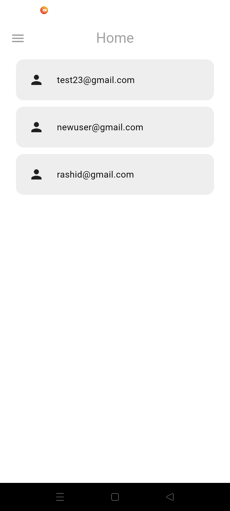
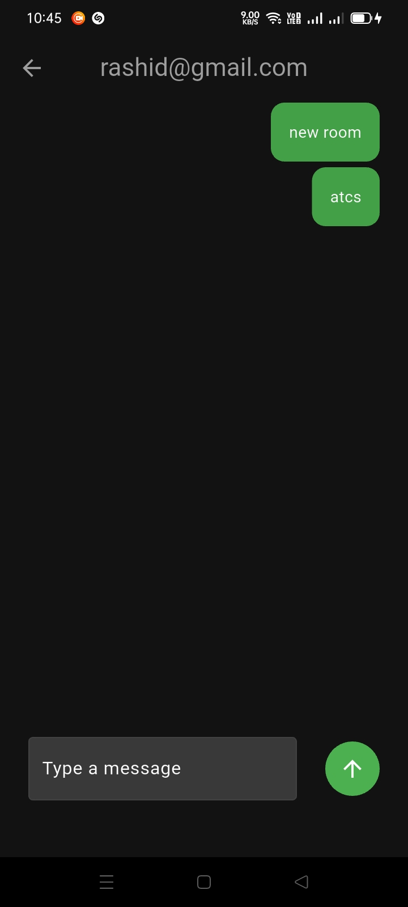
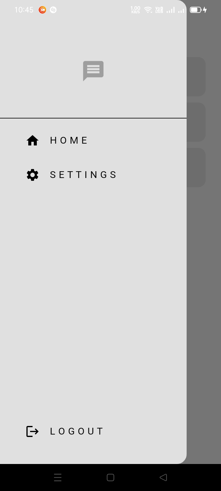
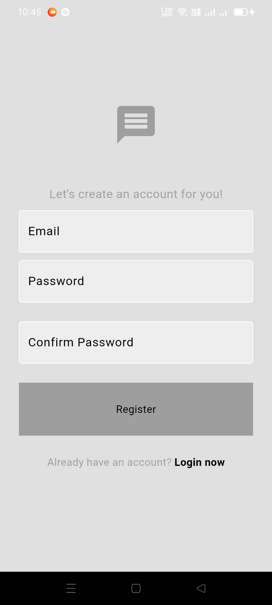
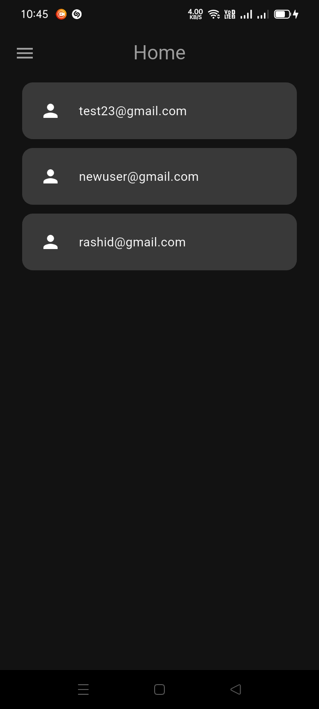

# 🗨️ Minimalistic Flutter Chat App

Welcome to a beautifully **simple and minimalistic** chat application built with **Flutter** and powered by **Firebase**! 🚀  
This app is designed for those who want a clean, lightweight chatting experience focused purely on the essentials.

---

## ✨ Features

- 🔥 **Authentication** – Sign up, log in, and log out seamlessly
- 🧑‍🤝‍🧑 **User Listing** – See all registered users
- 💬 **Private Chat Rooms** – Unique rooms generated for every user pair
- 📁 **Firebase Storage** – Upload and display profile pictures
- 🌗 **Dark Mode** – Instantly toggle between Light and Dark themes
- ⚡ **Real-Time Messaging** – Powered by Firebase Firestore
- 🛡️ **Secure** – Firebase Authentication and Firestore security rules

---

## 📸 Sneak Peek

> _Here’s a glimpse of the app in action!_

### App in Action (GIF):


### Light Mode:



### Dark Mode:



### Chat Screen:



### Login:



---

## 🛠️ Getting Started

Because of **security reasons**, only the `lib/` folder (the Flutter frontend code) is provided here.  
You’ll need to create your own Flutter project, configure Firebase, and replace the `lib/` folder with mine.

### Steps:

1. **Create a new Flutter project:**

   ```bash
   flutter create your_project_name
   ```

2. **Replace the `lib/` folder:**

   - Delete the `lib/` folder in your newly created project.
   - Copy the `lib/` folder from this repository into your project.

3. **Add Firebase to Your Project:**

   - Follow the official [Firebase setup guide for Flutter](https://firebase.google.com/docs/flutter/setup).
   - Download the `google-services.json` file for Android and place it in the `android/app/` directory.
   - Download the `GoogleService-Info.plist` file for iOS and place it in the `ios/Runner/` directory.

4. **Install Dependencies:**
   Run the following command to install all required dependencies:

   ```bash
   flutter pub get
   ```

5. **Run the App:**
   Start the app on your emulator or physical device:
   ```bash
   flutter run
   ```

---

## 🧩 Folder Structure

Here’s an overview of the folder structure for the `lib/` directory:

```
lib/
├── components/         # Reusable UI components (e.g., chat bubbles, text fields)
├── models/             # Data models (e.g., Message model)
├── pages/              # Screens (e.g., ChatPage, SettingsPage)
├── services/           # Firebase services (e.g., AuthService, ChatService)
├── themes/             # Theme configurations (e.g., light and dark mode)
└── main.dart           # App entry point
```

---

## 🔧 Dependencies

This project uses the following Flutter packages:

- `firebase_core` – Firebase integration
- `firebase_auth` – Authentication
- `cloud_firestore` – Real-time database
- `provider` – State management
- `flutter/material.dart` – UI framework

Install all dependencies with:

```bash
flutter pub get
```

---

## 🚀 Future Enhancements

- 🖼️ **Image Sharing** – Allow users to send images in chat
- 🔔 **Push Notifications** – Notify users of new messages
- 🌍 **Localization** – Support multiple languages
- 🧹 **UI Improvements** – Add animations and transitions

---

## 🤝 Contributing

Contributions are welcome! Feel free to fork this repository, make changes, and submit a pull request.

---

## 📜 License

This project is licensed under the MIT License. See the `LICENSE` file for details.

---

## 🙌 Acknowledgments

- Thanks to the Flutter and Firebase teams for their amazing tools and documentation.
- Inspired by the simplicity of modern chat apps.

---

### 📸 Add More Screenshots

You can add more screenshots in the `images/` folder and reference them in the README. For example:

- `images/1.jpg` – Light Mode
- `images/2.jpg` – Dark Mode
- `images/3.jpg` – Chat Screen

---

Let me know if you need further customization! 🚀
